# PhotoStorage Upload Architecture Analysis

## 1. High-Level Architecture

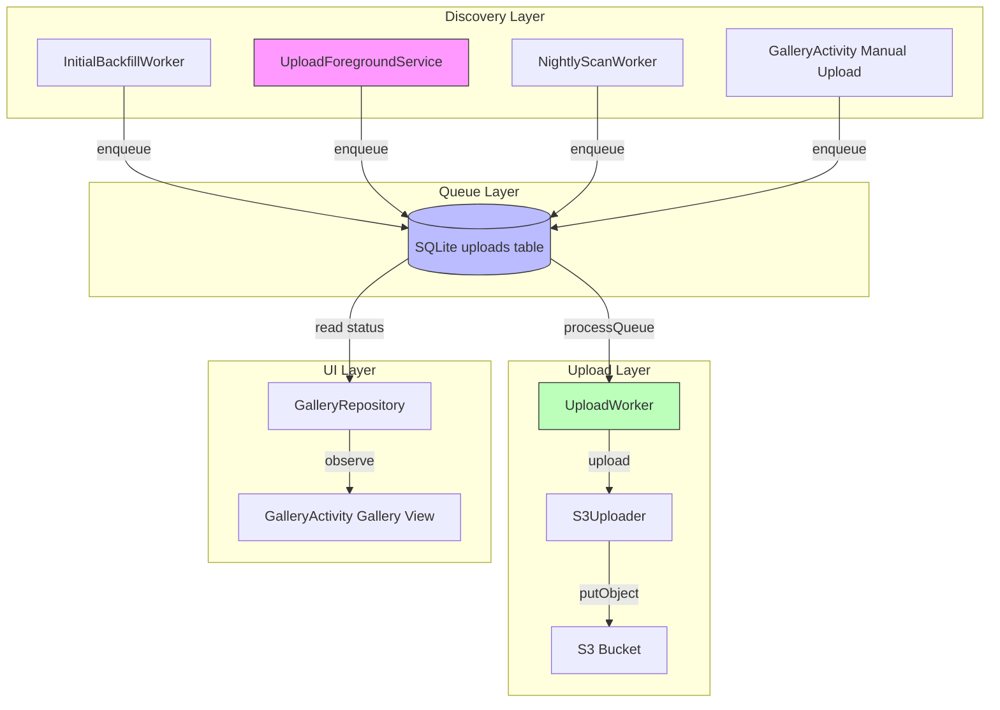

### Component Responsibilities

| Component | Role | Source File |
|---|---|---|
| `InitialBackfillWorker` | One-time scan after onboarding; seeds the queue | `worker/InitialBackfillWorker.kt` |
| `UploadForegroundService` | Real-time; ContentObservers on MediaStore trigger scans | `service/UploadForegroundService.kt` |
| `NightlyScanWorker` | Daily catch-up scan at 2am | `worker/NightlyScanWorker.kt` |
| `GalleryActivity` | Manual selection -> direct enqueue | `ui/GalleryActivity.kt` |
| `UploadWorker` | Processes `pending` + `failed retryable` records | `worker/UploadWorker.kt` |
| `GalleryRepository` | Merges MediaStore + DB for the UI | `gallery/GalleryRepository.kt` |

---

## 2. Discovery Paths

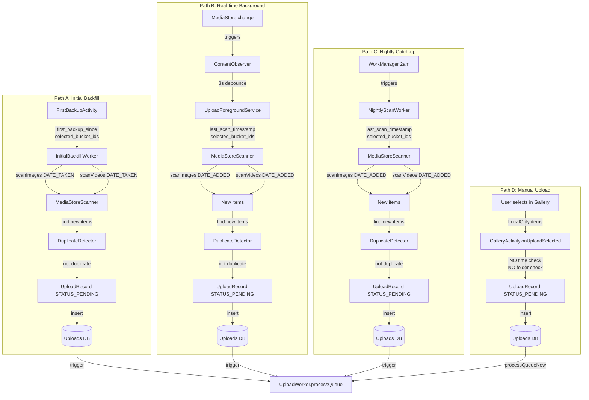

---

## 3. Time Bound System

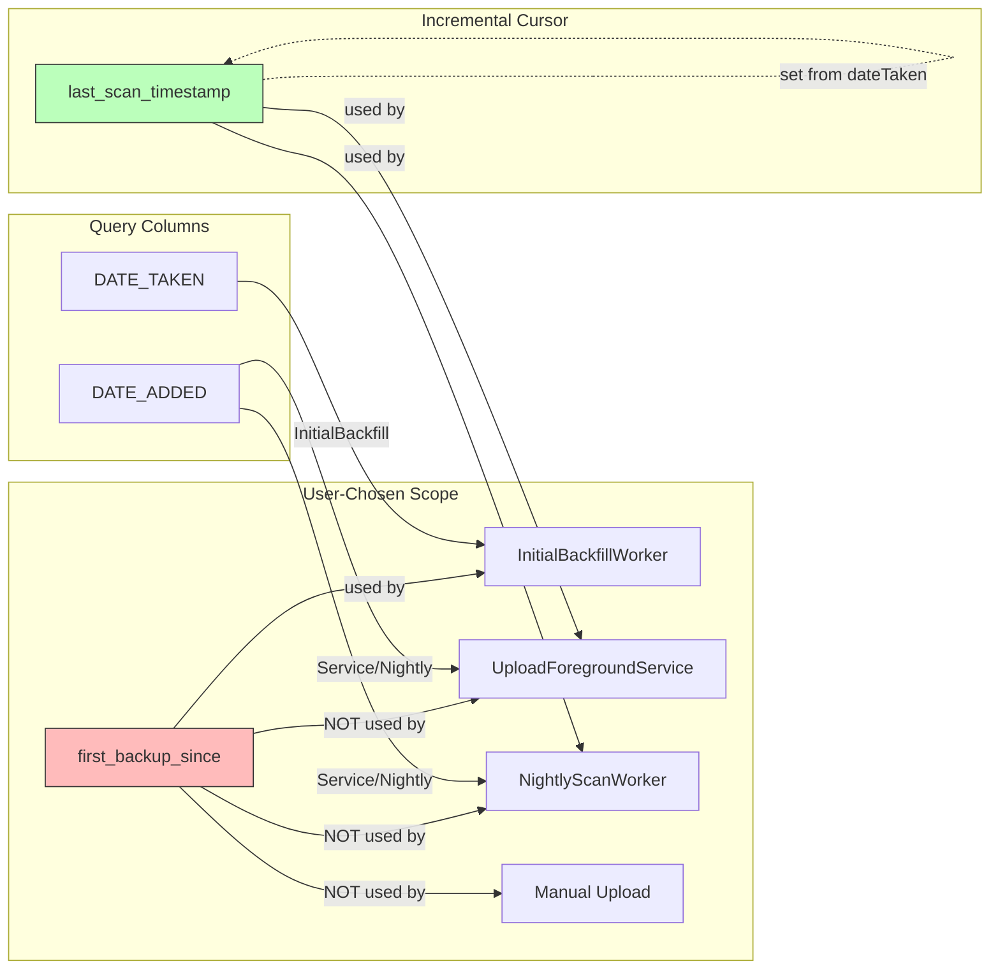

### Time Bound Behaviors

| Discovery Path | Time Source | Query Column | Respects User Scope? |
|---|---|---|---|
| Initial Backfill | `first_backup_since` | `DATE_TAKEN` | Yes |
| Foreground Service | `last_scan_timestamp` | `DATE_ADDED` (default) | No |
| Nightly Worker | `last_scan_timestamp` | `DATE_ADDED` (default) | No |
| Manual Upload | None | N/A | No |

---

## 4. Folder Selection Flow

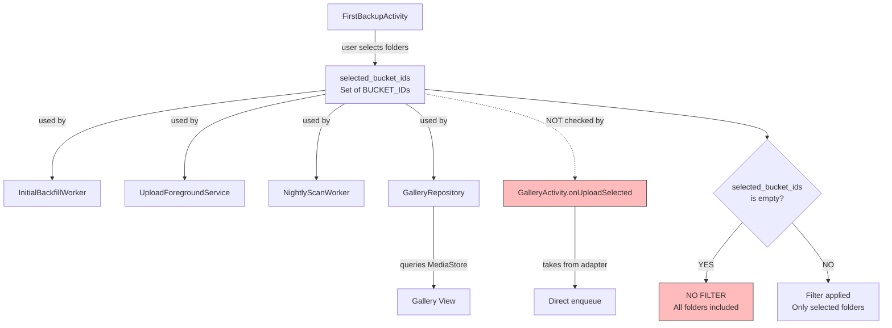

### Folder Filter Application

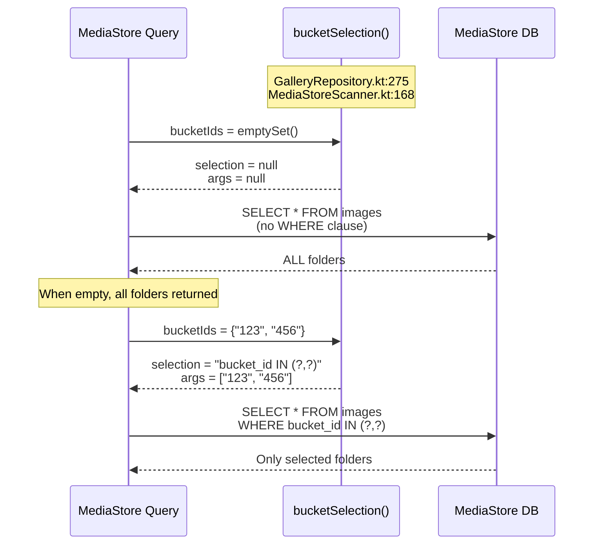

---

## 5. Upload State Machine

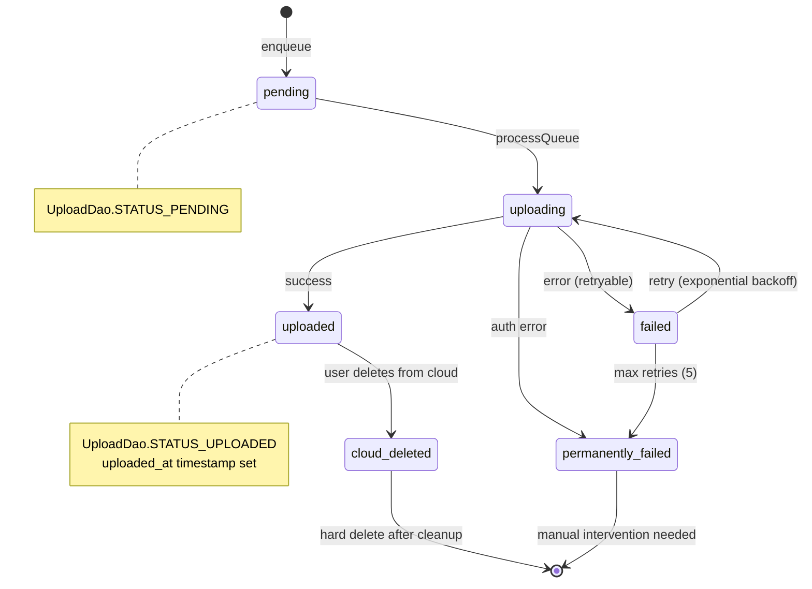

### UploadRecord Lifecycle

| Status | DB Value | Retryable? | Description |
|---|---|---|---|
| Pending | `pending` | N/A | Waiting in queue |
| Uploading | `uploading` | N/A | Currently being processed |
| Uploaded | `uploaded` | No | Successfully on S3 |
| Failed | `failed` | Yes | Temp failure, exponential backoff retry |
| Permanently Failed | `permanently_failed` | No | Auth error or max retries reached |
| Cloud Deleted | `cloud_deleted` | No | Soft-deleted, pending cleanup |

---

## 6. GalleryRepository Data Flow

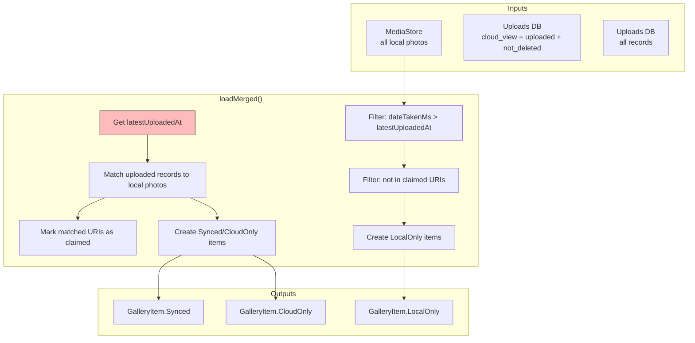

### Gallery View Modes

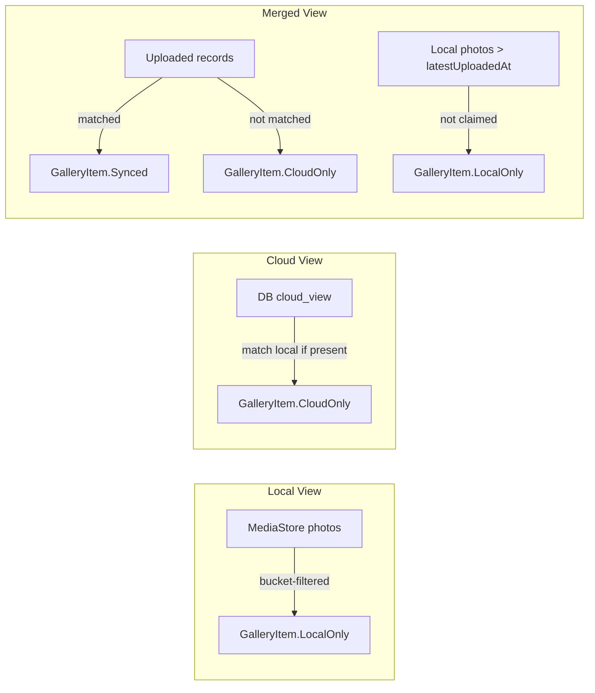

---

## 7. Service Lifecycle

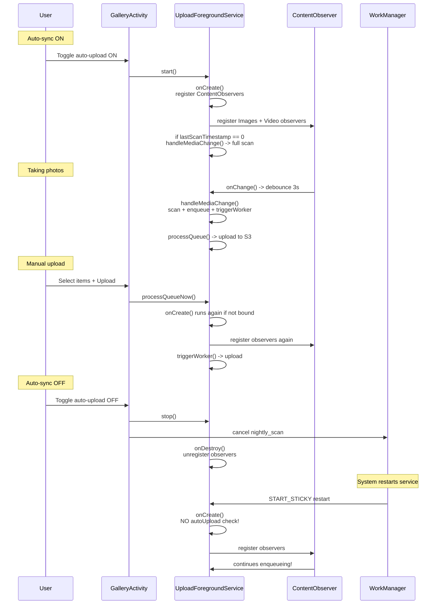

### Service Lifecycle Issues

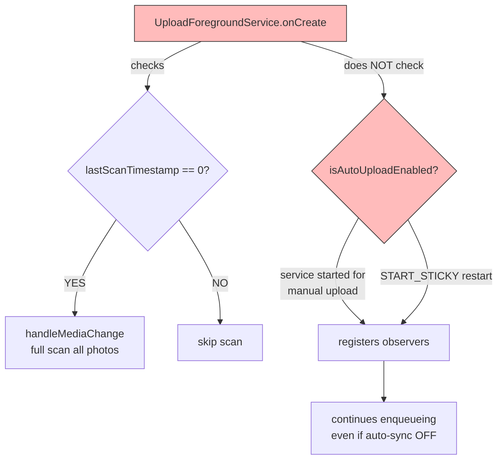

---

## 8. Deduplication Flow

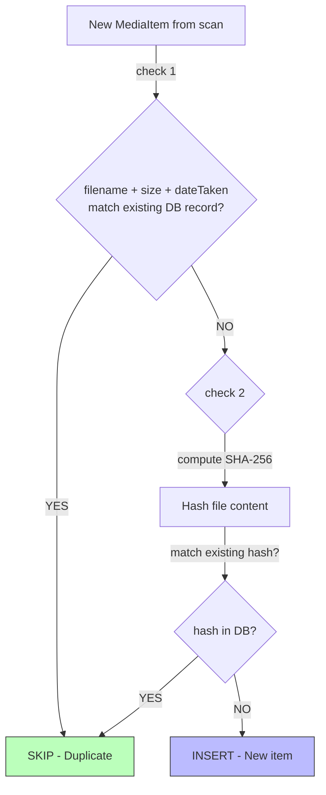

### DuplicateDetector Logic

| Check | Match Criteria | Cost | Location |
|---|---|---|---|
| 1 | `(filename, size, dateTaken)` | DB query only | `DuplicateDetector.kt:24` |
| 2 | SHA-256 of file content | Full file read | `DuplicateDetector.kt:28` |

---

## 9. Upload Mode Gate

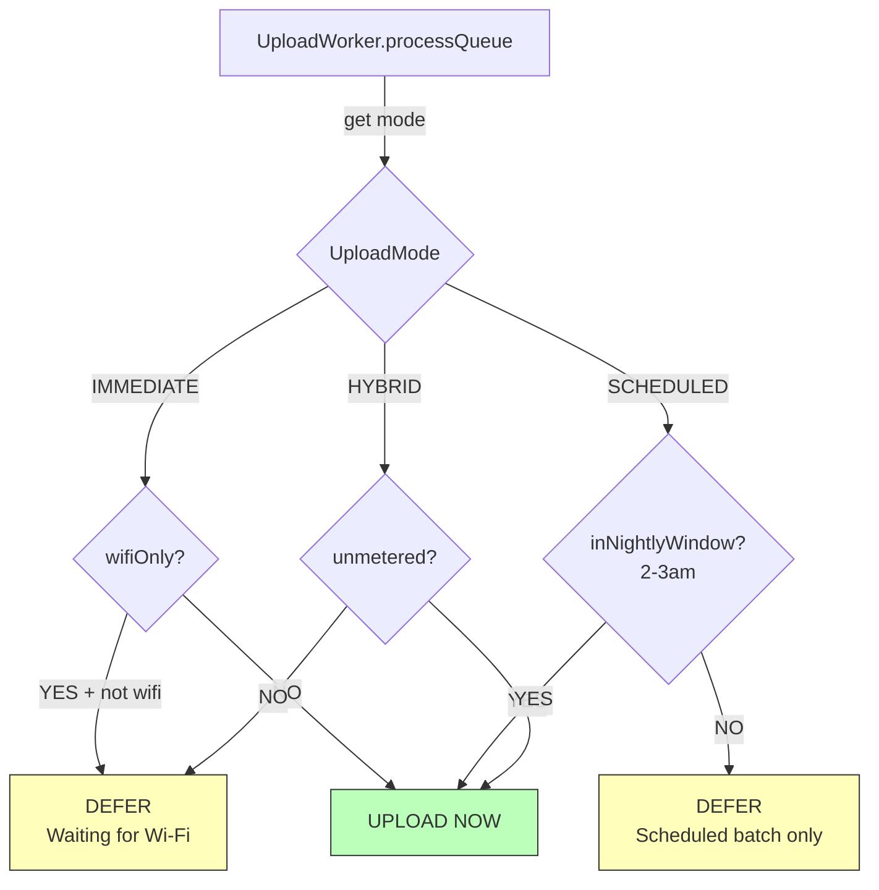

**Important:** The gate only controls **when** to upload, not **what** to upload. The queue is always populated.

---

## 10. Bug Summary Matrix

### Scope Enforcement by Discovery Path

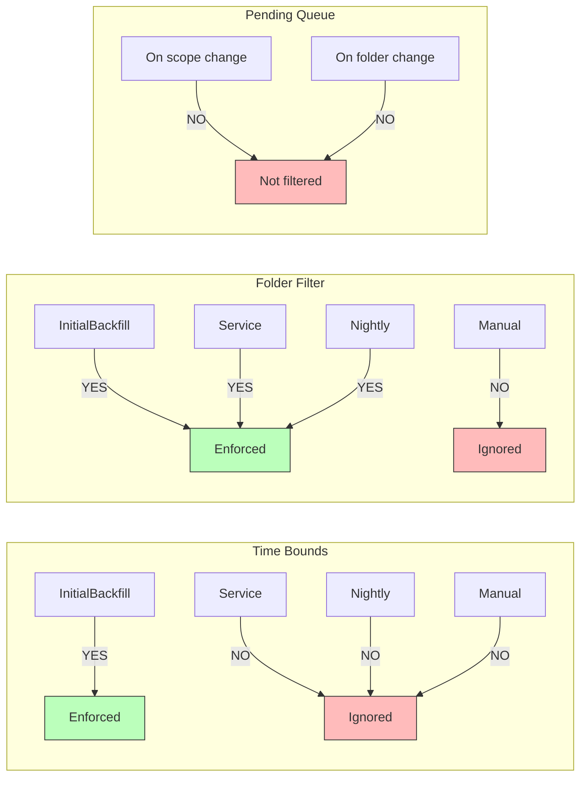

### Specific Bug Root Causes

| Bug | Root Cause | Location |
|---|---|---|
| **Time bounds ignored in manual mode** | `onUploadSelected()` has no time check; gallery shows all local photos | `GalleryActivity.kt:475-488` |
| **Time bounds ignored in background** | Service/Nightly use `last_scan_timestamp` + `DATE_ADDED`, not `first_backup_since` | `UploadForegroundService.kt:164`, `NightlyScanWorker.kt:30` |
| **Photos from other folders uploaded** | Empty `selectedBucketIds` = no filter; manual upload bypasses check | `MediaStoreScanner.kt:168`, `GalleryRepository.kt:276` |
| **Folder changes don't affect pending queue** | Already-queued items are not retroactively filtered | `UploadWorker.kt:57-59` |
| **Pending count persists after auto-sync OFF** | Queue not cleared; service lifecycle leak | `GalleryActivity.kt:197-203`, `UploadForegroundService.kt:74` |
| **Phantom enqueueing after sync OFF** | Service is `START_STICKY` with no `autoUploadEnabled` guard in `onCreate()` | `UploadForegroundService.kt:74`, `UploadForegroundService.kt:124` |
| **Old photos hidden from merged view** | `loadMerged()` filters by `latestUploadedAt` (upload time), not user scope | `GalleryRepository.kt:156` |

---

## 11. Key Files Reference

| File | Purpose |
|---|---|
| `worker/InitialBackfillWorker.kt` | One-time initial scan after onboarding |
| `worker/NightlyScanWorker.kt` | Daily catch-up scan |
| `worker/UploadWorker.kt` | Queue processor; uploads to S3 |
| `worker/UploadModeGate.kt` | Decides whether to upload now or defer |
| `service/UploadForegroundService.kt` | Foreground service with ContentObservers |
| `media/MediaStoreScanner.kt` | MediaStore query abstraction |
| `gallery/GalleryRepository.kt` | Merges MediaStore + DB for UI |
| `ui/GalleryActivity.kt` | Gallery UI + manual upload |
| `data/PrefsStore.kt` | All preference storage |
| `data/UploadDao.kt` | DB access for upload records |
| `data/UploadRecord.kt` | Upload record data class |
| `dedup/DuplicateDetector.kt` | Deduplication logic |
| `b2/S3Uploader.kt` | S3 upload operations |
| `b2/S3KeyBuilder.kt` | S3 key/path generation |
